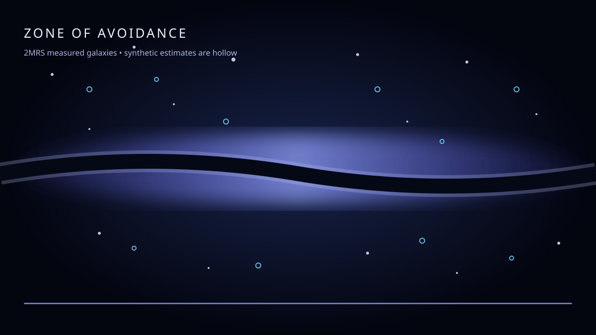

# Zone of Avoidance

[Open the live map](https://caleb-andersen.github.io/zone-of-avoidance/)

The Zone of Avoidance is the strip of sky where the Milky Way’s stars and dust make distant galaxies hard to see. It is not an empty region of the Universe: it is a blind spot in our view from inside our own galaxy. This project maps the nearby galaxies that were measured around that strip, then makes the missing part explicit instead of quietly drawing it as if it were observed.



## Data and provenance

The measured galaxy catalogue is the 2MASS Redshift Survey (2MRS), using table 3 of the VizieR release. The map ships the 43,507 usable catalogue rows in `public/data/2mrs.bin`; the 160 Mpc view contains 31,697 of them.

Full citation:

> Huchra, J. P., Macri, L. M., Masters, K. L., Jarrett, T. H., Berlind, P., Calkins, M., Crook, A. C., Cutri, R., Erdogdu, P., Falco, E., George, T., Hutcheson, C., Lahav, O., Mader, J., Mink, J., Martimbeau, N., Schneider, S., Skrutskie, M., Tokarz, S., & Westover, M. (2012). “The 2MASS Redshift Survey: Description and Data Release.” *The Astrophysical Journal Supplement Series*, 199(2), 26. https://doi.org/10.1088/0067-0049/199/2/26

- [VizieR catalogue J/ApJS/199/26](https://vizier.cfa.harvard.edu/viz-bin/VizieR?-source=J/ApJS/199/26)
- [VizieR table 3 used here](https://vizier.cfa.harvard.edu/viz-bin/asu-tsv?-source=J/ApJS/199/26/table3&-out=GLON,GLAT,cz,Kcmag&-out.max=unlimited)

The catalogue follows the [CDS/VizieR rules of usage](https://cds.unistra.fr/vizier-org/licences_vizier.html): retain the catalogue’s scientific attribution and acknowledge the VizieR service when using data obtained through it. The catalogue page does not declare a separate OSI/open-source licence for the table itself; it is not relicensed by this repository. This repository’s code and original assets are MIT-licensed under [LICENSE](LICENSE), but that licence does not override the catalogue’s own terms.

The galaxies shown inside the masked region are synthesised estimates, not measurements. Their aggregate count is an estimate based on the observed population and footprint; the position, distance, brightness, and morphology of any individual in that region are invented for visualisation and must not be treated as data.

The indigo mask is measured from the catalogue: `scripts/build-zoa-mask.mjs` bins the observed galaxies into equal-area `(l, b)` cells and finds the 50% completeness contour. Foreground stars, dust, and the filled-in galaxies are synthetic rendering layers.

## Rebuild the catalogue

The checked-in binary is a generated build product. To rebuild it from the source catalogue:

```bash
npm install
npm run catalogue
npm run density
npm run mask
npm run pack-half -- public/data/2mrs.bin public/data/2mrs.bin
npm run build
```

`npm run catalogue` downloads table 3, converts `GLON`, `GLAT`, `cz`, and `Kcmag` to observer-centred galactic Cartesian coordinates using the cosmology recorded in `public/data/2mrs.json`, and writes a float32 intermediate. `npm run density` appends the local-density channel; `npm run mask` regenerates `zoa-mask.json`; the final command packs the catalogue to float16 for the browser. The download endpoint and dropped-row counts are recorded in the manifest. Keep `2mrs.float32.bin` only as a local intermediate; it is ignored by Git.

## Run locally

```bash
npm install
npm run dev
```

For a production build:

```bash
npm run build
npm run preview
```

Pushes to `main` build `dist/` with Vite and deploy it through [`.github/workflows/pages.yml`](.github/workflows/pages.yml). The workflow uses the GitHub Pages artifact/deploy actions and requires the repository’s Pages setting to use **GitHub Actions** as its source.

## Interaction

Scroll, hold Space, use the arrow keys, or drag with two fingers. `PageDown`/`N` and `PageUp`/`P` move between chapters; `Home` and `End` jump to the ends. The bottom progress line is a keyboard-accessible scrubber. `prefers-reduced-motion` is respected.

The map also exposes `window.__zoa.setT(t)` and `window.__zoa.step(dt)` for deterministic captures; `#t=0.5` opens at a chosen point.

## Licence

The software in this repository is released under the [MIT License](LICENSE). The 2MRS catalogue remains third-party data distributed by CDS/VizieR and is subject to the catalogue’s attribution/usage terms described above.
